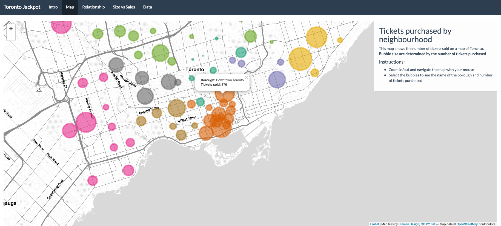
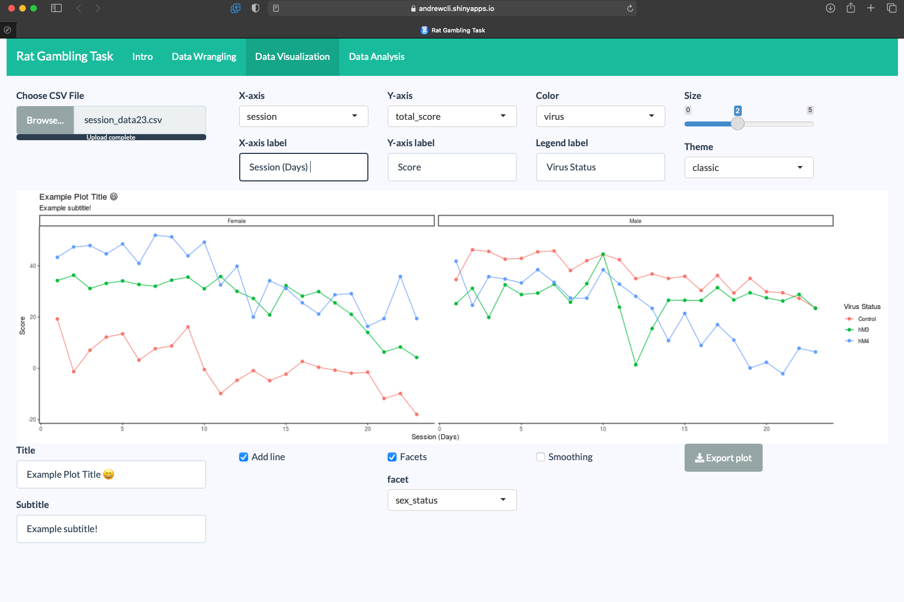
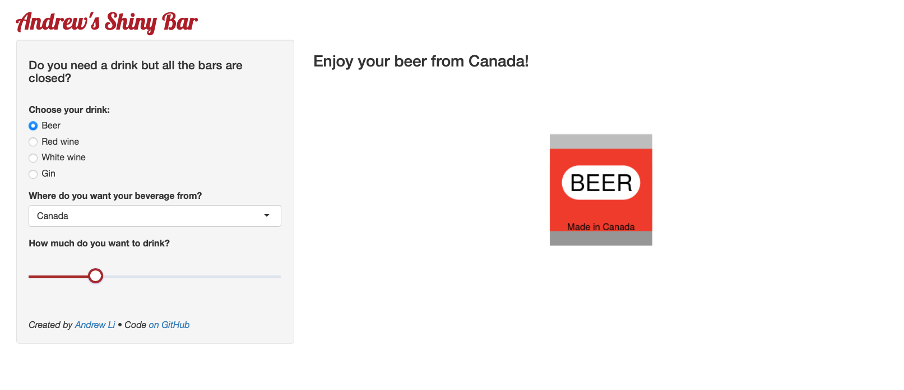
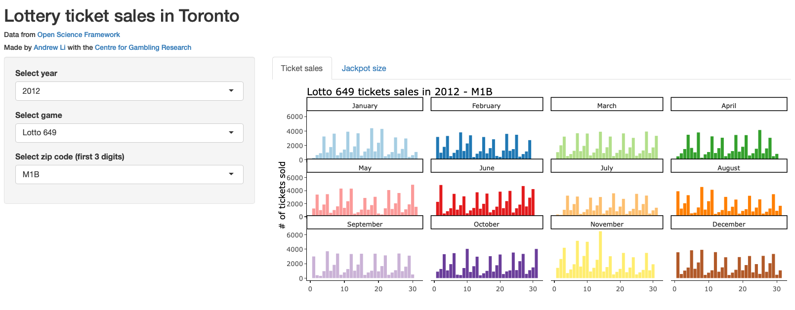

# shinyapps

<!-- badges: start -->


<!-- badges: end -->

These are some of the shiny applications that I have created. Each folder has its own README.

## shinyJackpot
An application to explore and visualize demographic and lottery ticket sales data in the greater Toronto area. This app is an upgrade to the first shiny app I ever made (Jackpot) Check out our [paper]() accompanying this app!

**Packages:** The application uses the following packages: [`shiny`](https://shiny.rstudio.com), [`tidyverse`](https://www.tidyverse.org), [`ggiraph`](https://davidgohel.github.io/ggiraph/articles/offcran/using_ggiraph.html), [`leaflet`](), [`shinythemes`](), and [`lottodata`](https://andr3wli.github.io/lottodata/). To see which versions of these pacshinyJackpot_draftkages are used and the dependencies, check the `session_info.txt` file in the app directory.

**Data sources:** The data for the lottery ticket sales were obtained from [Ontraio Lottery and Gaming Corporation](https://www.olg.ca/en/home.html) via a freedom of information act request. These data sets are freely available on [Open Science Framework](//osf.io/qwrxy/) and on [Github](https://github.com/andr3wli/lottodata). Geocoding was provided by [GeoCoder.ca](https://geocoder.ca).

**Launch application:**

```r
shiny::runGitHub(repo = "andr3wli/shinyapps", subdir = "shinyJackpot")
```

Or you can access shinyJackpot via my shiny server here: https://andrewcli.shinyapps.io/shinyJackpot/



<hr>

## shinyRGT
An application to easily tidy, explore and visualize rat gambling task data. As well, it can be especially useful for researchers using the RGT in tandem with DREADDs. Check out our [paper]() accompanying this app!

By: Andrew Li (UBC) and Georgios Karamanis (Uppsala)

**Packages:** The application uses the following packages: [`shiny`](https://shiny.rstudio.com), [`tidyverse`](https://www.tidyverse.org), [`shinythemes`](), and [`shinyWidgets`](https://github.com/dreamRs/shinyWidgets). To see which versions of these packages are used and there dependencies, look at the `session_info.txt` file in the repo directory. 

**Launch application:**

```r
shiny::runGitHub(repo = "andr3wli/shinyapps", subdir = "shinyRGT")
```

Or you can access shinyRGT via my shiny server here: https://andrewcli.shinyapps.io/shinyRGT/



<hr>

## Andrew's Shiny Bar
My submission for STAT 545 at UBC. With everything being online because of COVID, use this bar to enjoy your favourite drink and bar snack. 

**Packages:** The application uses the following packages: [`shiny`](https://shiny.rstudio.com), [`tidyverse`](https://www.tidyverse.org), [`shinyWidgets`](https://github.com/dreamRs/shinyWidgets), [`ggforce`](https://github.com/thomasp85/ggforce), [`geombeer`](https://github.com/andr3wli/geombeer).

**Launch application:**

```r
shiny::runGitHub(repo = "andr3wli/shinyapps", subdir = "shiny_bar")
```

Or you can access Shiny Bar via my shiny server here: https://andrewcli.shinyapps.io/andrews_bar/



<hr> 

## Jackpot
An R shiny application to visualize lottery ticket sales and lottery ticket size in Toronto, Canada. 

**Packages:** The application uses the following packages: [`shiny`](https://shiny.rstudio.com), [`plotly`](https://plotly.com/r/), [`lottodata`](https://andr3wli.github.io/lottodata/), [`tidyverse`](https://www.tidyverse.org).

**Data sources:** The data for the lottery ticket sales were obtained from [Ontraio Lottery and Gaming Corporation](https://www.olg.ca/en/home.html) via a freedom of information act request. These data sets are freely available on [Open Science Framework](//osf.io/qwrxy/) and on [Github](https://github.com/andr3wli/lottodata). 

**Launch application:**

```r
shiny::runGitHub(repo = "andr3wli/shinyapps", subdir = "jackpot")
```

Or you can access Jackpot via my shiny server here: https://andrewcli.shinyapps.io/Jackpot/


