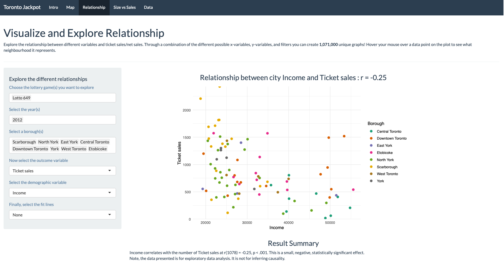

```{r setup, include=FALSE}
knitr::opts_chunk$set(echo = TRUE)
```

 
     
<h1> Toronto Lottery Ticket Sales Data Visualization </h1>

**What is this app?** An application to explore and visualize demographic and lottery ticket sales data in the greater Toronto area. Check out our [paper]() accompanying this app.

**Directory:** 

* `app.R` contains the source for the frontend and the backend
* `css` is for the map tab
* `data` contains the resulting clean data generated from `data_wrangling
* `data_wrangling` contains the R code that cleans data
* `md` contains the markdown files and images needed for the README and the intro tab
* `untidy_data` contains the CSV files to be cleaned
* `session_info.txt` contains information about the packages and there dependencies for this app 

**Data sources:** The data for the lottery ticket sales were obtained from [Ontraio Lottery and Gaming Corporation](https://www.olg.ca/en/home.html) via a freedom of information act request. These data sets are freely available on [Open Science Framework](//osf.io/qwrxy/) and on [Github](https://github.com/andr3wli/lottodata). Geocoding was provided by [GeoCoder.ca](https://geocoder.ca).

**Launch application:**
```{r}
#shiny::runGitHub(repo = "andr3wli/shinyapps", subdir = "shinyJackpot")
```

Alternatively, it is available on my Shiny server: [ADD LINK TO SHINY APP HERE]()





