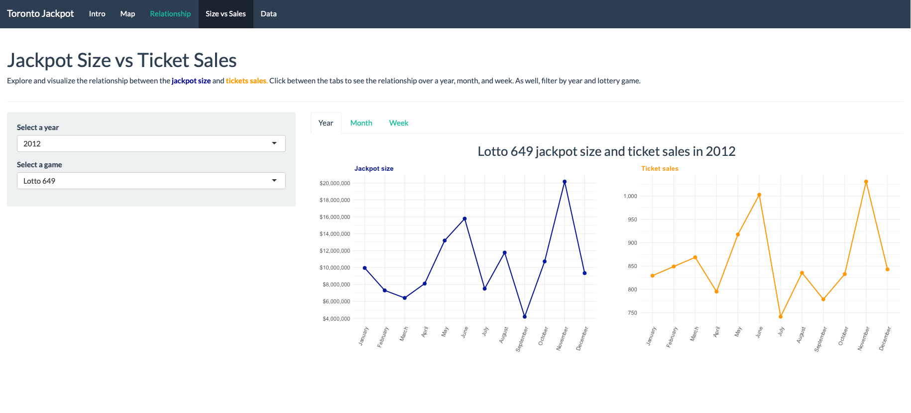

```{r setup, include=FALSE}
knitr::opts_chunk$set(echo = TRUE)
```

 
     
<h1> Toronto Lottery Ticket Sales Data Visualization </h1>

**What is this app?** An application to explore and visualize demographic and lottery ticket sales data in the greater Toronto area. Check out our [paper]() accompanying this app.

**Packages:** The application uses the following packages: [`shiny`](https://shiny.rstudio.com), [`tidyverse`](https://www.tidyverse.org), [`ggiraph`](https://davidgohel.github.io/ggiraph/articles/offcran/using_ggiraph.html), [`leaflet`](), [`shinythemes`](), and [`lottodata`](https://andr3wli.github.io/lottodata/). To see which versions of these packages are used and the dependencies, check the `session_info.txt` file in the app directory. 

**Data sources:** The data for the lottery ticket sales were obtained from [Ontraio Lottery and Gaming Corporation](https://www.olg.ca/en/home.html) via a freedom of information act request. These data sets are freely available on [Open Science Framework](//osf.io/qwrxy/) and on [Github](https://github.com/andr3wli/lottodata). Geocoding was provided by [GeoCoder.ca](https://geocoder.ca).

**Launch application:**
```{r}
#shiny::runGitHub(repo = "andr3wli/shinyapps", subdir = "shinyJackpot")
```

Alternatively, it is available on my Shiny server: [ADD LINK TO SHINY APP HERE]()




