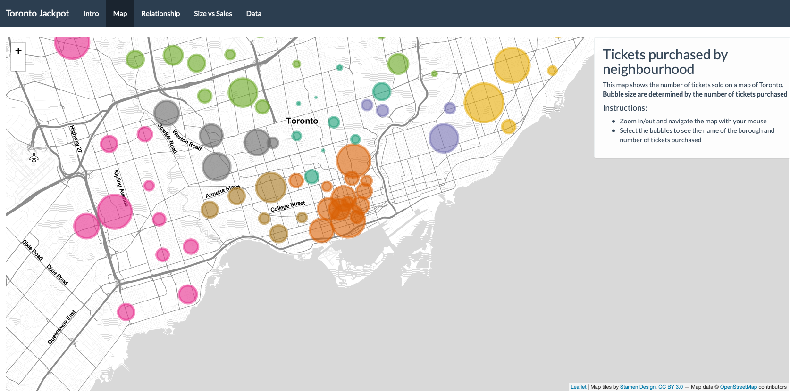
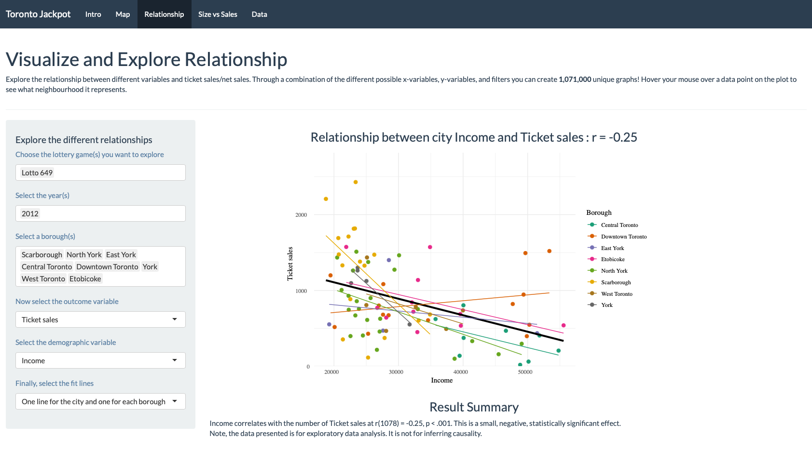

# Summary

Lottery gambling is widely enjoyed by Canadians and is the most popular form of legal gambling. As such, discovering and analyzing patterns in lottery gambling data is an important but nontrivial task. In this work, three methods were presented to process and visualize it to the end user to allow for faster pattern discovery. A bubble graph was utilized for the comparative analysis of lottery sales per each neighborhood of the city of Toronto, Canada. As well, a scatter plot was used to explore the relationship between different neighborhoods, lottery game product, year, lottery ticket sales, and demographic information. Lastly, a line graph was deployed to compare the jackpot size and ticket sales over time. `shinyJackpot` is deployed at `https://andrewcli.shinyapps.io/shinyJackpot/` for online use. The repository is available at `https://github.com/andr3wli/shinyapps`.

# Statement of need

Gambling is a widespread leisure activity that causes significant harm and cost. For some individuals, it has a direct financial impact that affects family members and friends. Lottery gambling has become so popular and enticing because of its low cost and potential prize reward [@ariyabuddhiphongs2011lottery]. However, lower income individuals spend a greater proportion of their income on lottery gambling than those with higher income  [@beckert2009inequality; @clotfelter1987implicit; @livernois1987redistributive; @miyazaki1998longitudinal]. Furthermore, ticket sales not only correlated with levels of income, but also with lower socioeconomic status (SES) [@lang2009can; @fu2021relationships}. As such, it is important to visualize and explore this data for analysis by experts or regular users who wish to discover trends. To the best of our knowledge, only one visualization exist for lottery data. Local Lotto is offered by the Civic Data Design Lab at MIT [@lim2015local]. The tool provides geographic distribution of percentage of income spend on lottery tickets. However, it is limited to Brooklyn, New York and is unavailable at this time. As such we propose a new tool, `shinyJackpot`, a shiny app that provides lottery gambling data at the city level and provides interactive data visualization tools that allows users to explore trends in the cost attributable to lottery gambling in Toronto, Canada. 

We hope that this tool would be of interests to data analysts exploring related questions, policy makers interested in past trends or the general public who wonder about the lottery gambling rate in their neighborhood and how it compares to other parts of the city. 

# Implementation

`shinyJackpot` was built almost entirely in R [@team2013r] and is extended using HTML and CSS. `shinyJackpot` was primarily intended to be used on its shiny server via its URL as users only need to need to have a web browser installed. However, it can be hosted on and launched locally on any system with R installed provided the prerequisite packages are installed. the latest version can be cloned or forked via the GitHub page. The latest version can be launched as follows: 

```
shiny::runGitHub(repo ="andr3wli/shinyapps", subdir = "shinyJackpot")
```

The current implementation of `shinyJackpot` is dependent on several R packages including shiny [@chang2021shiny], tidyverse [@tidyverse], ggiraph, DescTools [@signorell2019desctools], DT, leaflet [@leaflet], Lubridate [@grolemund2011dates], lottodata, and shinythemes. 


# Features

## Intro

The Intro tab explains and introduces the users to the shiny app. Furthermore, it provides insights and motivations as to why we created this shiny app. Finally, it includes the contact information of the author and maintainer as well as acknowledgements.


## Map

As shown in Figure 1, the Map tab visualizes the number of tickets purchased by neighborhood. It uses a bubble plot over a map of Toronto with the size of the bubble indicating the numbers of ticket purchased. The different colors represent different boroughs roughly corresponding to: Central Toronto, Downtown Toronto, East York, Etobicoke, North York, Scarborough, West Toronto, and York. The map was generated via the leaflet package [@leaflet]. The bubble size represents the number of tickets sold in the neighborhood - larger bubbles represents more tickets sold.  

Users are able to navigate the map with their mouse and interact with the bubble to see the exact number of tickets purchased for a specific neighbourhood.


<div align="center"> Fig 1. User interface of the Map tab. The bubbles are interactive and allow users to gain more information when they hover over a specific bubble.</div>

## Relationship

As seen in Figure 2, the Relationship tab allows users to visualize and explore the relationships between the different variables. Using a side bar panel, users can select the specific lottery game(s), year(s), and borough(s) to visualize. Next, users select either ticket sales or net sales for the outcome variable. Then, users can select income, education, socioecomomic status, population, or MBSA as the demographic variable. Lastly, users can choose to add a best fit line of the city, multiple lines for the boroughs, or both. A plot and the correlation is reported from the selected variables. The plot is produced via the ggplot2 package [@ggplot2 and is made interactive via the ggiraph package. 


<div align="center"> Fig 1. User interface of the Relationship tab. The individual dots are interactive, when users hover their mouse over a specific dot, it will inform users of the specific neighbourhood.</div>

## Size vs. Sales

The Size vs. Sales tab visualizes the relationship between the jackpot size and the ticket sales. Users are able to select the specific year and the specific lottery game to explore. As well, users are able to track this relationship yearly, monthly, or weekly. A plot of the jackpot size and the ticket sales are presented and users are able to clearly and easily see the change in ticket sales and jackpot size. Again, these plots are generated with the ggplot2 package.

## Data
The data tab offers users the opportunity to explore the data set interactively via the side panel. Here, users can filter through the year, lottery game, and borough(s). The filtered data set will be made available to explore on the app or for download for further analysis. 

# Licensing and Availability

`shinyJackpot` is licenced under the GNU General Public Licence (v3.0). All of its source code was made publicly available in its [https://github.com/andr3wli/shinyapps/tree/main/shinyJackpot](GitHub) repository. Furthermore, there is a corresponding issue tracker for bug reporting and feature enhancements. Requests for fixes, feature updates, general questions and concerns can be made by [https://github.com/andr3wli/shinyapps/issues](filling an issue). Lastly, users are encouraged to contribute to the development of `shinyJackpot`. 

# Acknowledgements

I would like to thank Luke Clark from the Centre for Gambling Research at UBC for his mentorship and opportunity to conduct research at his lab. As well, I would like to thank Ross Otto and Hin Ngai-Fu from McGill University for making the data sets used in this app open access and freely available. Geocoding data used in the Map tab was made available by `https://geocoder.ca`.

# References
