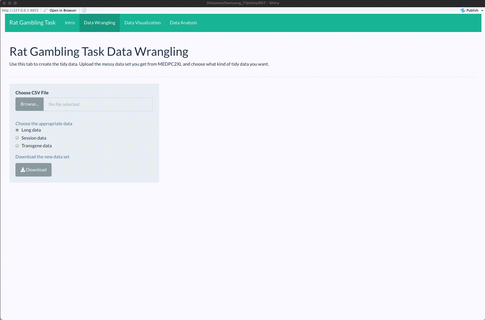

```{r setup, include=FALSE}
knitr::opts_chunk$set(echo = TRUE)
```

<!-- badges: start -->


<!-- badges: end -->

<h1 id="logo">  Rat Gambling Task</a> </h1>

#### What is this app?
A GUI to easily tidy, explore and visualize rat gambling task data. As well, it can be especially useful for researchers using the RGT in tandem with DREADDs. Check out our [paper]() accompanying this app. 

#### Directory
* `app.R` contains the R code that generates shinyRGT
* `md` contains the markdown files and images needed for the README and for the intro tab
* `session_info.txt` contains information about the packages and there dependencies for this app

#### Launch application:
```{r}
shiny::runGitHub(repo = "andr3wli/shinyapps", subdir = "shinyRGT")
```

Alternatively, it is available on my Shiny server [here](https://andrewcli.shinyapps.io/shinyRGT/)

#### Citation
If you find this work helpful, please cite our work. Thanks!
```
ADD THE BIBTEX CITATION HERE
```

#### Examples

**Data Wrangling:**


**Data Visualization:**


#### Related work and repositories

* ["Serotonergic and dopaminergic modulation of gambling behavior as assessed using a novel rat gambling task"](https://pubmed.ncbi.nlm.nih.gov/19536111/) in Neuropsychopharmacology
* ["Chemogenetic inhibition of dopaminergic projections to the nucleus accumbens has sexually dimorphic effects in the rat gambling task"](https://www.researchgate.net/profile/Tristan-Hynes/publication/342118840_Chemogenetic_inhibition_of_dopaminergic_projections_to_the_nucleus_accumbens_has_sexually_dimorphic_effects_in_the_rat_gambling_task/links/5efe3ed4299bf18816fcc825/Chemogenetic-inhibition-of-dopaminergic-projections-to-the-nucleus-accumbens-has-sexually-dimorphic-effects-in-the-rat-gambling-task.pdf) in Behavioral Neuroscience
* ["DREAADs for neuroscientists"](https://www.ncbi.nlm.nih.gov/pmc/articles/PMC4759656/) in Neuron
