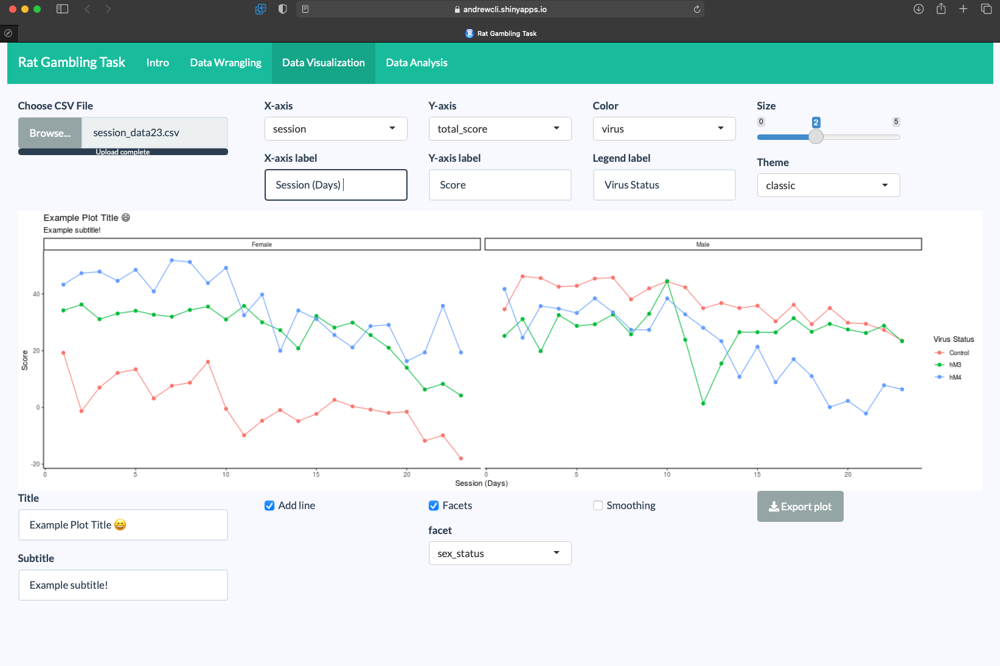

shinyRGT
================

<!-- badges: start -->


<!-- badges: end -->

<h1 id="logo">
 Rat
Gambling Task</a>
</h1>

#### What is this app?

An application to easily tidy, explore and visualize rat gambling task
data. As well, it can be especially useful for researchers using the RGT
in tandem with DREADDs. Check out our [paper]() accompanying this app.

#### Packages

The application uses the following packages:
[`shiny`](https://shiny.rstudio.com),
[`tidyverse`](https://www.tidyverse.org), [`shinythemes`](), and
[`shinyWidgets`](https://github.com/dreamRs/shinyWidgets). To see which
versions of these packages are used and there dependencies, look at the
`session_info.txt` file in the repo directory.

#### Launch application:

``` r
#shiny::runGitHub(repo = "andr3wli/shinyRGT")
```

Alternatively, it is available on my Shiny server
[here](https://andrewcli.shinyapps.io/shinyRGT/)

#### Citation

If you find this work helpful, please cite our work. Thanks!

    ADD THE BIBTEX CITATION HERE

#### Examples

**Data Wrangling:** 

**Data Visualization:** 

#### Related work and repositories

-   [“Serotonergic and dopaminergic modulation of gambling behavior as
    assessed using a novel rat gambling
    task”](https://pubmed.ncbi.nlm.nih.gov/19536111/) in
    Neuropsychopharmacology
-   [“Chemogenetic inhibition of dopaminergic projections to the nucleus
    accumbens has sexually dimorphic effects in the rat gambling
    task”](https://www.researchgate.net/profile/Tristan-Hynes/publication/342118840_Chemogenetic_inhibition_of_dopaminergic_projections_to_the_nucleus_accumbens_has_sexually_dimorphic_effects_in_the_rat_gambling_task/links/5efe3ed4299bf18816fcc825/Chemogenetic-inhibition-of-dopaminergic-projections-to-the-nucleus-accumbens-has-sexually-dimorphic-effects-in-the-rat-gambling-task.pdf)
    in Behavioral Neuroscience
-   [“DREAADs for
    neuroscientists”](https://www.ncbi.nlm.nih.gov/pmc/articles/PMC4759656/)
    in Neuron
